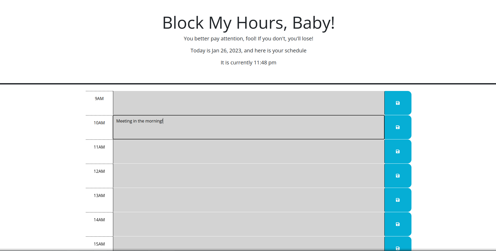

# Block My Hours Baby

## Task

Create a simple calendar application that allows a user to save events for each hour of the day by modifying starter code. This app will run in the browser and feature dynamically updated HTML and CSS powered by jQuery.

## Usage

This planner, which can be found [here](https://omgthegreenranger.github.io/block-my-hours-baby/), allows you enter an event on an hour of the day. It will also inform you if you are already beyond the time of day.

The script is designed to be extendable to multiple days, though the feature is not yet developed (time limited for the project).

## Further details

None at the moment.
